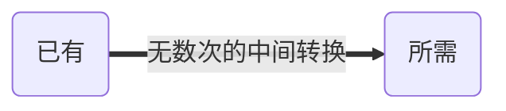

知己知彼，百战不殆 ——《孙子兵法》。

> 本文仅总结鄙人所知的反爬虫方式，不涉猎任何具体的分析与绕过方案。

# 反爬虫

反爬虫，即应对爬虫进行反制的统称，**主要区分“正常用户”与“机器人”的一种策略统称**。

## 认识反爬虫

​		正所谓知其然，知其所以然。对于反爬虫的措施有所了解与认知，一方面便于快捷定位防护点实现分析或绕过，另一方面组成爬虫攻防体系。万变自不离其宗，应对反爬虫措施游刃有余。一般常在如下几大部分**设伏**。

>  以下便不考虑第三方测试工具的校验

### 请求前校验

#### **抓包拦截**

​		做过爬虫的小伙伴，一定知道在分析加密、执行爬虫项目之前。首先第一步一定是先抓包，定位到对应数据包，然后继续才进行分析或规律。那么在此无疑是**最为有效**的反抓，捕获不到流量包URL未知，除了使用自动化测试工具、RPC等通常可能都毫无办法。

抓包拦截又可细分为控制台检测、端口转移、证书校验，私有协议总而言之就是让你抓不到包，其方法无所不用其极。

控制台检测抓包绕过策略：

- 替代法: 采用**中间人抓包**（Charles、mitmproxy、firdler等）

- 分析绕过法：定位到检测处，分析绕过

端口转移绕过策略：

- 强制端口
- 流量转发

**证书锁定与公钥锁定**

​		为了防止中间人攻击，采用SSL-Pinning的技术来反抓包。 中间人抓包要点是伪造了一个假的证书实现拦截与转发，从而在中间获取的过路数据包实现抓包。
反抓思路就是，客户端也预置一份服务端的证书，比较一下就知道真假了。SSL-pinning有两种方式证书锁定（Certificate Pinning）与公钥锁定（Public Key Pinning）

证书锁定

> ​		证书锁定是SSL/TLS加密的额外保证手段。它会将服务器的证书公钥预先保存在客户端。在建立安全连接的过程中，客户端会将预置的公钥和接受的证书做比较。
> 如果一致，就建立连接，否则就拒绝连接。在客户端设置证书只允许设置指定域名的证书，而不接受操作系统或浏览器内置的CA根证书对应的任何证书。

公钥锁定

>  HTTP公钥锁定是HTTPS网站防止攻击者CA机构错误签发的证书进行中间人攻击的一种安全机制，用于预防CA遭受入侵或其他会造成CA签发未授权证书的情况。
> 采用公钥锁定时，网站会提供已授权公钥的哈希列表，指示客户端在后续通讯中只接受列表上的公钥。提取证书中的公钥并内置到客户端中，通过与服务器对比公钥值来验证连接的正确性。

绕过：Hook到证书校验，无论如何返回正确的即可

**私有协议通讯**

一线大厂自定义通讯协议，自然考虑到了抓包。那么自然而然也设置了反抓包

绕过：Hook、沙箱

#### 运行环境检测

CDN网络分发加验证:经典产品5秒盾

> 其核心为 请求 -> cdn -> 返回关键参数 -> 通过 -> 数据(可能为假)

### 请求校验

> 当抓到包之后，便是模拟用户请求了。那么这里的常见的反抓措施有哪些呢

请求校验，即在发送请求时即对网络请求时进行校验，实现区分。**通过则返回数据，未通过不返回或返回假数据**常有如下几种方式

#### **协议校验**

常见通用的协议有HTTP1.0、 HTTP1.1、HTTP2.0 ，若强行只允许HTTP2.0协议来完成请求与响应。那么平常使用其他

#### **TSL指纹**

每个请求库其实是有自己的库指纹，若只允许某段或某规则指纹通过，那么自然而言实现了反抓的效果。

#### header校验

header校验又可分为两种。其一是字段校验，其二是header字段顺序校验

header各字段校验，如ua、sign、cookie、token、safe等

> 绕过方案或思想：
> 通过JS解密或逆向获取关键参数缺啥补啥，完成模拟即可

header字段顺序：当我们打开一个网页其实是一个新的会话那么在未断开或重新连接的时候那么这个顺序就是固定的。而字典格式中位置其实是随机分配的，自定义客户端刷新，对header取指纹或字段顺序检测即可实现鉴别

> 绕过方案或思想：保持会话一致

#### 参数校验

通常字段不仅在header中校验还经常在请求参数中，如sgin、token、safe等。

> 参数不可无缘无故来，主要来源JS 生成、服务器下发(不限于文件、JS、wasm等)。又可进行多次中间操作

#### 前后端分离技术Ajax

> 严格来说并不算反扒而是前后端分离技术,但常常结合反抓共同出现

Ajax（异步JavaScript和XML）也叫不刷新页面请求。

#### RPC防护

采用RPC及加密或编码方式实现前后端分离、微服务架构等。

> rpc结合反抓基本步骤，客户端请求(中间极有可能涉猎加密)RPC服务端，RPC客户端(原服务端)再次(中间极有可能涉猎加密)请求(一次或多次)。实现“分端”请求，多端加密。

> 逆写rpc进行调用，模拟“第一次”客户端请求rpc无差别，绕过

#### 请求校验小结

通常设置参数有两种情况，

1. 二次或多次请求：
   1. RPC：客户端请求，服务端使用RPC等再请求。
   2. AJax
2. JS设置关键参数（**含二次刷新删除源文件跳转页面**）

## 验证码

* 识别点选或输入型
* 滑轨、滑块型
* 计算型
* 空值补齐型
* 空间推理型
* 短信或语音验证型

## 风控

范围极大极广，简而言之，用户行为、运行环境等是否**合理**。从而实现区分

IP封禁

代码运行环境检测

等


### 数据保护

在不改变原有展示的情况下实现**“隐藏”**

通常数据保护有以下种方式：

1. 动态字体
2. CSS偏移
3. 内容加密映射
4. SVG映射等
5. 内容图片化

## 代码防护

### JS代码混淆

在遇见需要逆向的参数时候，往往不像表面一个参数那般平静。一查看各种混淆、防护又来了。怎么办怎么办，肝啊！当然也可以使用渲染工具模拟，此方案在此便不在过多赘述。

代码混淆是增加分析难度而牺牲部分性能的一种方案，此方案大部分是体现在通过逻辑转换换等方式将代码转化为难以分析的代码。难以分析是混淆的目的，等价转换是需要确保混淆前后的代码需不影响运行的功能。对于混淆可以又分为如下四种：布局混淆、数据混淆、控制混淆、预防混淆

**布局混淆**

布局混淆指在源代码中删除原有无用代码，处理常量名、变量名函数名等标识符，增加对于代码的阅读与分析。

无用代码：注释、调试信息、缩进、换行、无用函数与数据等

处理常量名、变量名函数名等标识符：

* 标识重命名：将原有代码重命名为无具体意义的字符，例如 将name 重命名为a

>  注意点：作用域内标识符碰撞情况

**小结**：布局混淆并不会影响执行的过程、内存开销，甚至代码体积反而减少了。

**数据混淆**

JS拥有常见的7种数据类型，number、string、boolean、unfined、null、Object

**数字混淆**

数据混淆有常见：进制转换、数字分治、其他

- 进制转换：将十进制转化为二进制、八进制、十六进制等，从而达到“混淆”的目的

- **数学分治**：简而言之就是将数拆开，例如 2 = 1 + 1，也等于2 - 1 - 1 + 2再辅以数学公式等

- 其他：重新赋值等


**字符串混淆**

字符串混淆常见的有编码转换编译、加密。常见的有hash、base64、md5等

**boolean**

我们都知道Boolean值为True、False。根据对boolean的处理，变成难以显示阅读的代码。

```
!0,!1
![], !![]
!{},!!{}
!NaN,!!NaN
!"", !!""
!undefined, !!undefined
!null, !!null
!Object, !!Object
!void(0),!!void(1)

|,||, &, &&, Boolean()
```


**控制混淆**

控制混淆是指对程序的控制流进行转换变化，常见的方式有插入僵尸代码、控制流平坦化

插入僵尸代码：插入僵尸代码即插入无用的代码，增强调试难度

控制流平坦化：控制流平坦化,将原本的的执行流程平坦化。具体可自行搜索

**预防混淆**

主要体现在 提高反混淆的难度或检测现有混淆器中的漏洞设计

### JS虚拟机

自定义或定制JavaScript虚拟机，基于给予二进制文件获取结果

### Android/iOS SDK 加固保护

**代码混淆**

> 具体可参考JS混淆部分，殊归同途

**Dex 加固与抽取**

​		Dex 加固即将需要保护的代码单独生成Dex，在so加载时解密jar并通过DexClassLoader加载到内存里。该方案的主要问题在于解密后的Dex会以文件形式存储在手机内存中，而且通过内存dump 的方式能够获取解密后的jar 包，而没有生成文件加载的方式存在很多兼容性的问题

​		在实际对抗环境下，Dex 无论如何保护，都有方法还原至原始的Dex，进而反编译得到Java 代码。而C 代码相对而言较难逆向。Java2c 是指将原有的Java 代码抽取出来，通过jni 在native 层反射实现。

流程如下：Dex→smali→抽取+native 化→生成so

抽取后的原始Java 函数，反编译出来是native 函数，在运行过程中也不会还原。Java2c 配合C 语言的代码混淆技术和字符串混淆技术，可以对Android 的Java 代码起到很好的保护效果。同时也不需要对原始Java 代码进行重写

**LLVM**

LLVM 是Low Level Virtual Machine 的缩写，其定位是一个比较底层的虚拟机。然而LLVM 本身并不是一个完整的编译器，LLVM 是一个编译器基础架构，把很多编译器需要的功能以可调用的模块形式实现出来并包装成库，其他编译器实现者可以根据自己的需要使用或扩展，主要聚焦于编译器后端功能，如代码生成、代码优化、JIT 等。

**代码虚拟化**

​		代码虚拟化保护技术是一种比Dex 文件保护、Java2c 技术更强的安全防护技术，可以更有效地对抗逆向工程或破解，避免造成核心技术和风控逻辑被泄密的问题。


## 总结



以上便是本人对于所见所知所想的反爬虫，各种加密、编译、混淆等。中间围绕无数种可能。一起加油吧！！！

好像什么都说了，什么都没说。望君参考却不限于此。

总体来说就是抓包、请求前校验、请求校验、数据保护。以及风控、验证码、及对于代码进行保护。